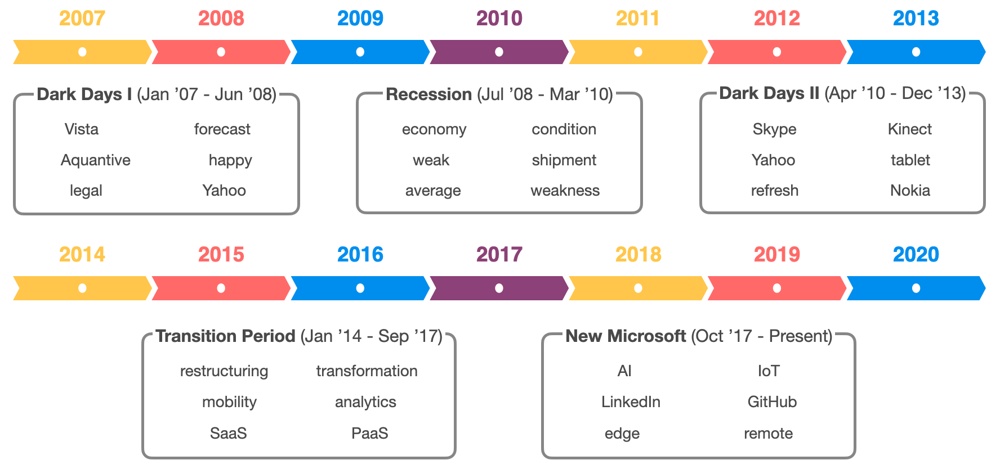
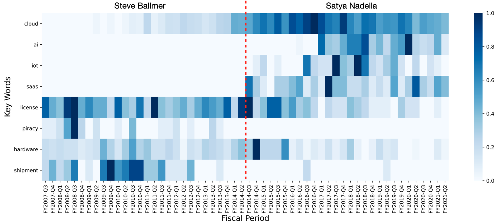
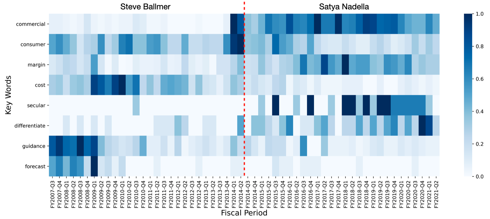
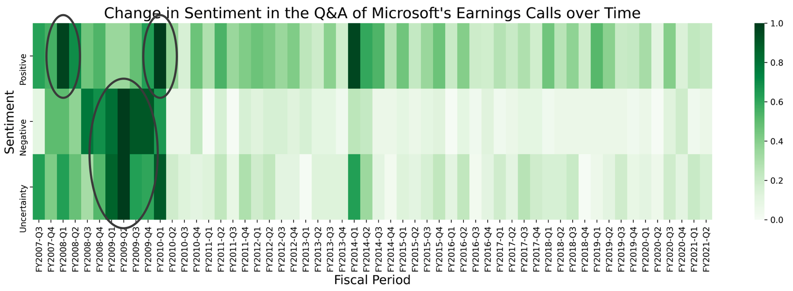
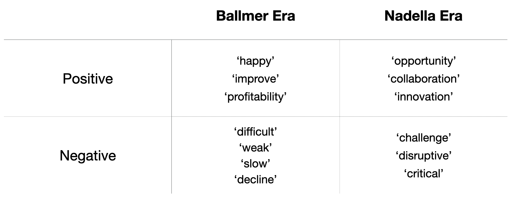
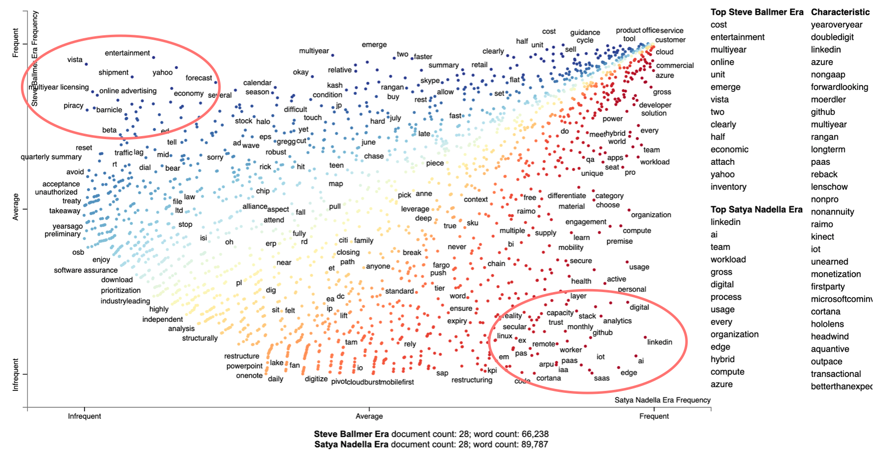
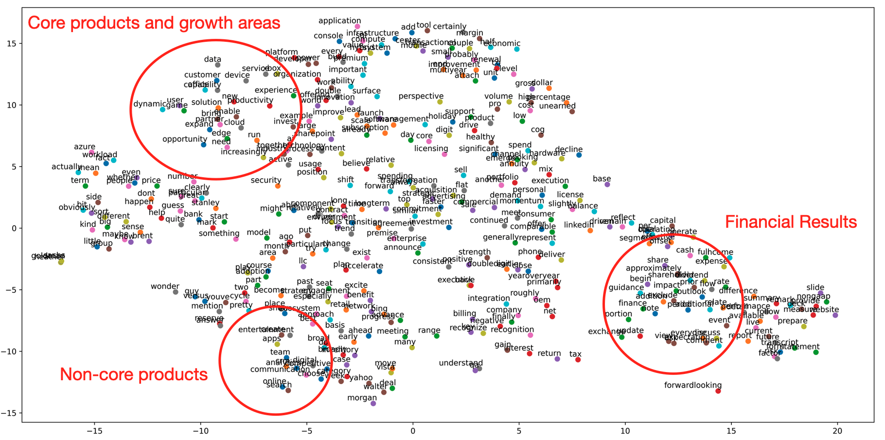

# Investigating Microsoft's Transformation under Satya Nadella:
## *Decrypting Quarterly Earnings Calls with NLP*

### Motivation - Incorporating NLP into qualitative investment analysis

- I’m a firm believer that a qualitative analysis of a company is as important or in some cases, more important than a quantitative analysis when it comes to investing.  One of the key components of that analysis is understanding the CEO - his philosophy, strategy, and culture he brings down on the company. 

- The work becomes even more paramount when there is a CEO change.  The place where investors get to have a view into a CEO’s mind is when the company hosts quarterly investor calls to discuss financial results.  So that’s where I was naturally drawn to see if NLP can be applied. 

- I chose to look at Microsoft, because it is a perfect example of where a change in CEO catalyzed a transformation in the company.  New CEO Satya Nadella, took over the reins from Steve Ballmer in February 2014, and the changes he made over the next seven years translated to a financial success as well. So my goal was to analyze Microsoft’s earnings transcripts in pre- and post-Satya Nadella days to extract insights about how the company’s philosophy and strategy evolved over time.

### Data and Tools 

- **Data:** I gathered 56 Microsoft earnings call transcripts from a financial data service platform called Capital IQ - 28 during Satya Nadella’s tenure, and 28 under the former CEO, Steve Ballmer.
 
- **Tools used:** Numpy, Pandas, NLTK, SpaCy, Seaborn, Matplotlib, Scikit-learn, Gensim, Scattertext, Loughran-McDonald Financial Sentiment Dictionary, WordCloud, TextBlob, Textstat.

### Topic Modeling - History of struggles, transition, and emergence

I performed topic modeling to get five topics, each comprised of six topic words and interestingly, the result was a neat 14-year history of Microsoft, with the topics coming one after another chronologically to form five distinct periods.

- The first and third periods come right before and after the 08-09 recession, and I call them the **dark days** because the words mostly describe Microsoft’s various missteps and struggles.  For example, 'Vista' and 'Kinect' were failed product launches.  'Nokia', 'Aquantive', and 'Skype' were all disastrous acquisitions.  The word 'legal' relates to the company’s antitrust charges.  Microsoft also made several unsuccessful attempts to acquire 'Yahoo' to better compete with Google search, which also ended up being a disaster.  It’s interesting you see the word 'happy' here - turns out management overused the word with statements like ‘we are happy with our product' or 'we are happy with our results’ during the calls to deflect questions about their missteps.

- The second topic has words like 'economy', 'condition', and 'weak' that characterize a global **recession** and Microsoft was obviously not immune to the downturn.

- Then comes the transition period after Satya Nadella took over the reins, as implied by the words restructuring and transformation.  Words like mobility, SaaS, and PaaS reflect his idea of aggressively shifting software to a subscription-based model and making the company’s cloud product Azure the centerpiece of his long-term growth strategy.  

- Lastly the most recent three years or so are characterized by Microsoft’s attempt to compete at the frontiers of technology using its strength in productivity software, cloud, and developer platforms, rather than playing catch up in foreign grounds like search and smartphone.

### Keyword frequency - how has Microsoft’s strategy evolved over time?

Now I wanted to take a closer look and see if certain keywords gained or lost importance over time as Microsoft’s strategy and philosophy changed. 

- As you would expect the words like 'cloud', 'AI' and 'SaaS' have increased over time under Satya Nadella.  On the other hand, words like 'license', 'piracy', and 'shipment' decreased in importance over time as the company moved away from licensed software model and hardware strategy.  

- Some other keywords that I found contrasting relationships were 'commercial' and 'consumer', and it shows Satya’s another strategy was shifting focus from consumer to large commercial customers.  Another trend is that there is emphasis on margin and deemphasis on cost over time as the company has pulled away from hardware and pushed cloud products.

- Lastly, I think these four words show differences in Steve Ballmer and Satya Nadella’s philosophies that allowed the latter to lead a successful turnaround.  The words ‘guidance’ and ‘forecast’ were more prevalent in the early years and it shows the company was overly focused on meeting its own short-term financial targets.  On the other hand, the words ‘secular’ and ‘differentiate’ used often by Satya reflect his focus on creating differentiated products in areas like AI and IoT that have long-term secular growth.  

 | 
------------- | -------------

### Sentiment analysis - Has the tone gotten more positive or negative over time?

Then, I performed sentiment analysis to see if I could gain additional insights on the tone of the earnings call and link it back to changes in philosophy and strategy.  I used Loughran-McDonald Financial Sentiment Dictionary to find the count of words in the transcripts that match those from the dictionary in the positive, negative, and uncertainty categories. 

- The sentiment of the calls turned pretty negative during the recession, and it also detected a lot of ‘uncertainty’ during the period.  Also, the sentiment was highly positive immediately before and after the financial crisis.  It appears that the rest of the periods doesn’t show any particular trend… 

- …Until you look at the words picked up by the sentiment dictionary in the two sets of transcripts.  While both periods show similar count of positive words, the words themselves are very different.  The words ‘happy’ and ‘improve’ under Steve Ballmer are used to put a positive spin on the company’s many struggles during this period, while the words ‘opportunity’ and ‘innovation’ under Satya are definitely more forward-looking.   

- Similarly in negative words, ‘difficult’, ‘weak’, and ‘decline’ all describe the actual dire situations that Microsoft were in, whereas negative words under Satya are in fact neutral or even positive in the context of describing his strategy (e.g., meeting customer 'challenges', introducing 'disruptive' products).  

### Conclusion and next steps

- My biggest takeaway is that from looking at the topic models, frequency of words, and sentiment over time, the positive change in Microsoft’s philosophy and strategy under Satya Nadella was pretty evident.  My next steps are to split my documents into smaller parts such as by speaker or by sentence to see if I get different results.  I could also perform similar NLP analysis on another case where a change in CEO brought about a failed transformation in the company and compare the findings with those of Microsoft.  

**Please check out my blog post on this project [here](https://mikechoi90.medium.com/investigating-microsofts-transformation-under-satya-nadella-f49083294c35).**

**Further plots and results can be found in the [project presentation](Presentation/Metis_Project4_PPT_vF.pdf). The main project code can by found in .py files and Jupyter notebooks located [here](Code).**

### Appendix

